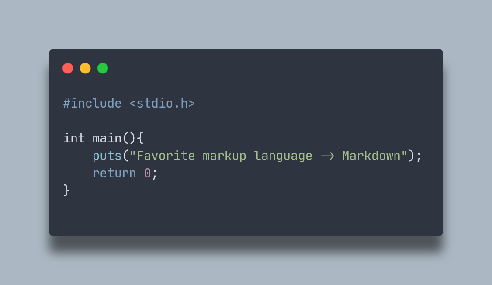

**Languages I know:** Lua, Python, Brainfuck, LOLCODE, Bash (basics), English

**Language Im learning:** C

**Languages I want to learn:** Rust/Go

---

**Projects for this year 🥅:**
  - [x] Get into Linux 🖥️
  - [x] Work with APIs
  - [x] Learn Lua
  - [x] Discord bot programming 🤖
  - [ ] Make a full-fledged line editor (led doesn't have all the features) 🗒️
  - [ ] Make a game with RPG Maker 🎮
  - [ ] Do some GBA programming 🎮
  - [ ] Chip8 Emulator (might be too hard but worth a try :/
  - [ ] TUI dev

**Distros I want to try 💻:**
  - [x] P̸o̸p̸O̸S (had problems with sysdboot) Linux Mint
  - [ ] Arch (vanilla)
  - [ ] ArchCraft
  - [ ] Artix

**Standalone wms i want to try:**
  - [x] AwesomeWM
  - [ ] BSPWM
  - [ ] Openbox/Fluxbox
  - [ ] Fvvm

---

