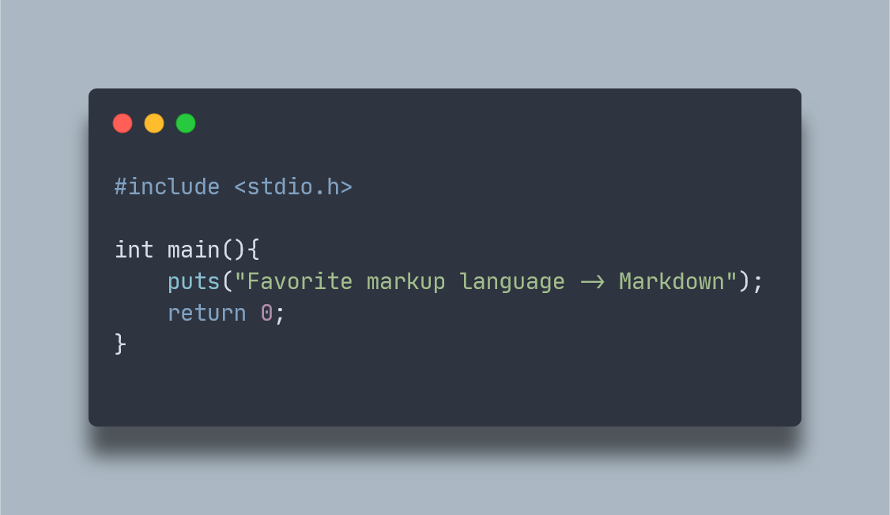

<h3 align='center'>Hlo there, Im MetaStag 👋</h3>

</img>

**Languages I know:** Lua, Python, Brainf\*\*k, LOLCODE, Bash (basics)

**Language Im learning:** C

**Languages I want to learn:** Rust/Go

---

**Currently using:**
  - **Distro:** ArcoLinux
  - **WM:** Awesome
  - **Text Editor:** Neovim

**Projects for this year 🥅:**
  - [x] Get into Linux 🖥️
  - [x] Work with APIs
  - [x] Learn Lua
  - [x] Discord bot programming 🤖
  - [ ] Make a full-fledged line editor (led doesn't have all the features) 🗒️
  - [ ] Make a game with RPG Maker 🎮
  - [ ] Do some GBA programming 🎮
  - [ ] TUI dev
  - [ ] Learn GUI dev using gtk or something else and make a Music Player 🎵

**Distros I want to try 💻:**
  - [ ] PopOS
  - [ ] Arch (vanilla)
  - [ ] ArchCraft
  - [ ] Artix

**Standalone wms i want to try:**
  - [x] AwesomeWM
  - [ ] BSPWM
  - [ ] Openbox/Fluxbox
  - [ ] Fvvm

---

  
Code stuff I like 🖋️ 

   
  
 **Text Editors** -> Neovim, Atom, led

  
 **Themes** -> Tokyo Night Storm, Nord, One Dark, Palenight

  
 **Fonts** -> JetBrains Mono, Cascadia Code, Fantasque Sans Mono, Fira Code, Kungfont 

  
Hobbies 🎮 

   
  
 -> Programming, watching anime & sitcoms, casual gaming and occasionally reading some books 

  
Profile Stats 

   
    

